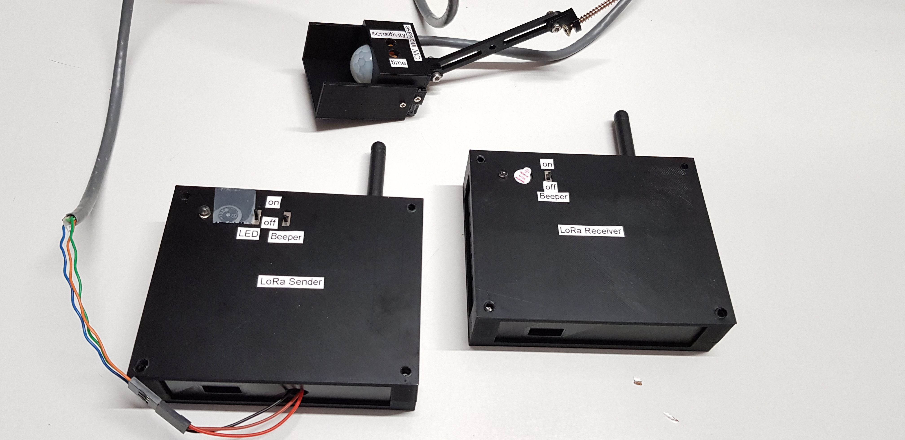
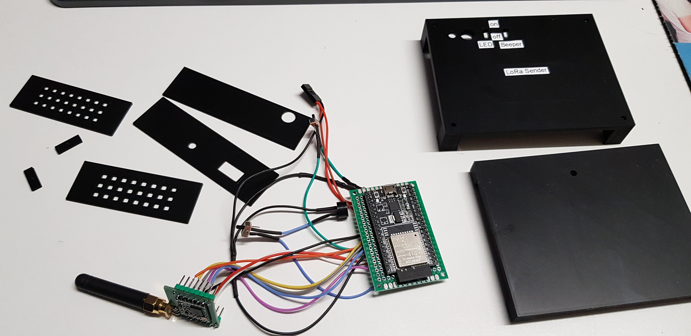
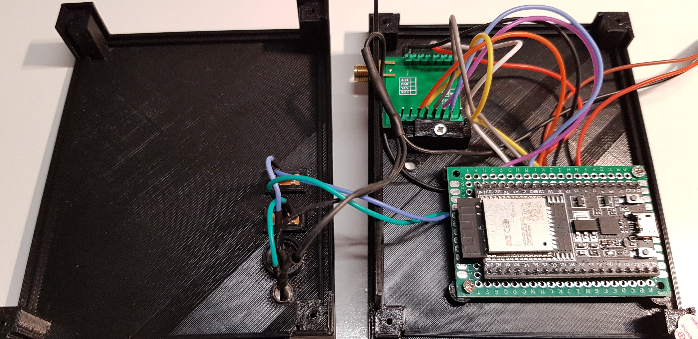
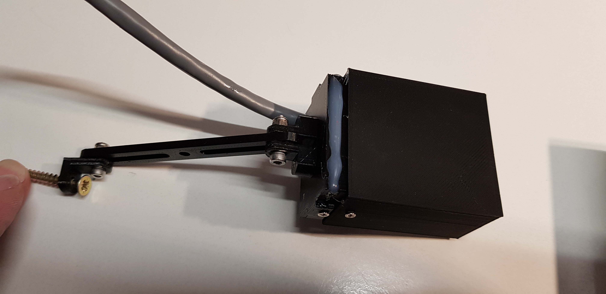
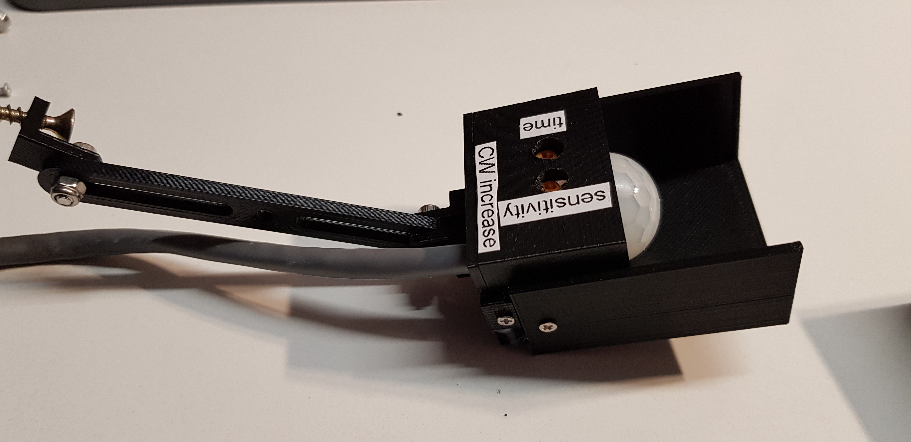

# Motion sensor communicating over LoRa
The challenge is to detect motion when someone enters the premise and send it over a longer distance to a location 50+m away where the residents are located and are triggered via a signal that someone is coming.

## Description and operation instructions
The motion sensor HC-SR501 in combination with LoRa RFM95W-868S2 transceiver is used to send a LoRa signal when motion is detected. At some distance the signal is received with a LoRa RFM95W-868S2 transceiver and LED and beeper will signal that the motion sensor was triggered. The RFM95W-868S2 are controlled via a ESP32-WROOM-32U at the transmitter and receiver.

 ## Technical description
The LoRa RFM95W-868S2 transceiver is connected to the ESP32-WROOM-32D

 ### LoRa Transmitter
| LoRa RFM95W-868S2 | ESP32      | LED + 3k3 risistor| 3,3V beeper    | HC-SR501 | 
| ------------------|------------|-------------------|----------------| -------- |
| GND               | GND        | GND               | GND            |          |
| Reset             | D14        |                   |                |          |
| NSS               | D5         |                   |                |          |
| SCK               | D18        |                   |                |          |
| MOSI              | D23        |                   |                |          |
| MISO              | D19        |                   |                |          |
| 3.3V              | 3V3        |                   |                |          |
| DIO0              | 25         |                   |                |          |
|                   |            | D26               |                |          |
|                   |            |                   | D12            |          |
|                   |            |                   |                | D27      |

### LoRa Receiver
| LoRa RFM95W-868S2 | ESP32      | LED + 3k3 risistor| 3,3V beeper    | 
| ------------------|------------|-------------------|----------------|
| GND               | GND        | GND               | GND            |
| Reset             | D14        |                   |                |
| NSS               | D5         |                   |                |
| SCK               | D18        |                   |                |
| MOSI              | D23        |                   |                |
| MISO              | D19        |                   |                |
| 3.3V              | 3V3        |                   |                |
| DIO0              | 25         |                   |                |
|                   |            | D26               |                |
|                   |            |                   | D12            |
|                   |            |                   |                |

### Parts
- 1 x ESP32-WROOM-32U

### Schematic overview

The drawing is not completely correct as Pin DIO0 is connected to 25 as listed in the table above. I was lasy and copied the drawing from Randomtutorials. Which I'm thankfull for good instructions to get me started.

### ESPHome installation
See the instructions https://github.com/Wilko01/ESPHome  (not listed here)

### ESPHome Configuration in Home Assistant
Create a new device  with this code:

### Interface
There is no interface with anything as this needs to run stand-alone.

### Testing
Place it somewhere were motion is and check if the signal comes in.

## 3D printer files
It all started by measuring the air quality when printing, so the 3D printer files must be included in this project:
- [3D files include the Sketchup make file as well as the 3D print files .STL](/3D_Printer_Files)
- [Thingiverse](https://www.thingiverse.com/thing:5155707)

### Information

Generic
- [Markdown Cheat Sheet](https://www.markdownguide.org/cheat-sheet/)

### Problems
- The receiver did not respond after 2 to 3 hours. 
    On 05-12-2021 Disabled almost all 'print to serial' commands. Printing of Strings takes a lot of memory, hence commented out all the print to serial commands which are not in the setup loop.

### Wishlist
..

