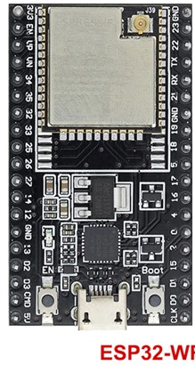
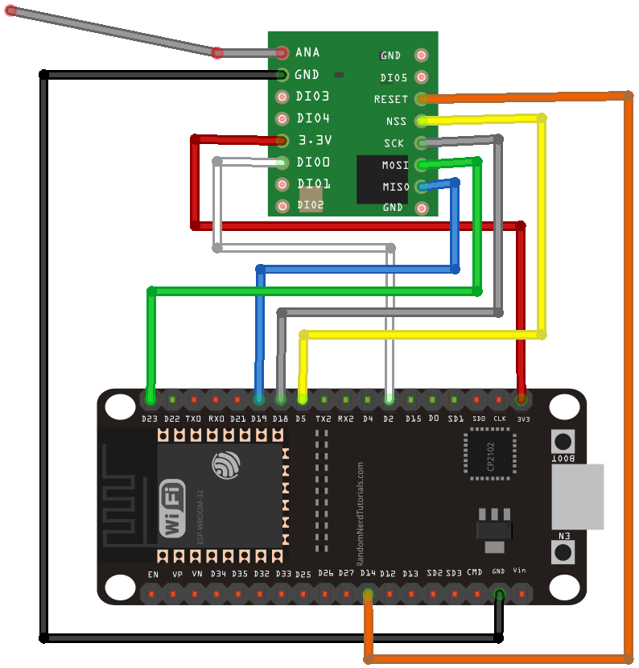

# Motion sensor communicating over LoRa
The challenge is to detect motion when someone enters the premise and send it over a longer distance to a location 50+m away where the residents are located and are triggered via a signal that someone is coming.


## Description and operation instructions
The motion sensor HC-SR501 in combination with LoRa RFM95W-868S2 transceiver is used to send a LoRa signal when motion is detected. At some distance the signal is received with a LoRa RFM95W-868S2 transceiver and LED and beeper will signal that the motion sensor was triggered. The RFM95W-868S2 are controlled via a ESP32-WROOM-32U at the sender and receiver.

 ## Technical description
The LoRa RFM95W-868S2 transceiver is connected to the ESP32-WROOM-32D

| LoRa RFM95W-868S2 | ESP32      | LED + 3k3 risistor   | 3,3V beeper |
| ------------------|------------|-------------------|--------------|
| TX                | rx_pin: 16 |                   |              |
| RX                | tx_pin: 17 |                   |              |
| GND               | GND        | GND       | GND    |
| 5V                | 5V         | 5V        | 5V     |
|                   | 18         | SDA       |        |
|                   | 19         | SCL       |        |
|                   | 21         |           | Signal |
|                   | 27         |           |        |


### Parts
- 1 x ESP32-WROOM-32U



- 1 x 2.4GHz antenna


- 4 x Screws 2.6 x 20 mm
- 1 x thumbtack
- 1 x Micro USB connector


### Schematic overview


### ESPHome installation
See the instructions https://github.com/Wilko01/ESPHome  (not listed here)


### ESPHome Configuration in Home Assistant
Create a new device  with this code:
```
# Defining an SDS011 Air Quality Sensor in ESPHome
esphome:
  name: esp17
  platform: ESP32
  board: esp32doit-devkit-v1
  on_boot:
    priority: -100 #lowest priority so start last
    then:
      - lambda: id(display01).turn_off();
#End first code block

# Enable logging
logger:

# Enable Home Assistant API
api:

ota:
  password: "4764505ce89048d2422149c83dbc51ca"

wifi:
  ssid: !secret wifi_ssid
  password: !secret wifi_password

  # Enable fallback hotspot (captive portal) in case wifi connection fails
  ap:
    ssid: "Esp17 Fallback Hotspot"
    password: "kWzangCTxyzK"

captive_portal:

# Defining the UART for the SDS011
uart:
  rx_pin: 16
  tx_pin: 17
  baud_rate: 9600

sensor:
  - platform: sds011
    pm_2_5:
      name: "ESP17_Particulates_<2.5µm_Concentration"
      id: pm2_5
    pm_10_0:
      name: "ESP17_Particulates_<10.0µm_Concentration"
      id: pm10_0
    # Set the update interval to balance the accuracy and sensor life
    update_interval: 10min

# Define the temperature and humidity sensor
  - platform: dht
    pin: 21
    temperature:
      name: "ESP17_Temperature"
      id: ESP17_Temperature
    humidity:
      name: "ESP17_Humidity"
      id: ESP17_Humidity
    update_interval: 60s

#specify the connection to the SSD1306
#Connect to the GND and 3,3 but better to 5V
i2c:
  sda: 18
  scl: 19
  scan: true #Will display the i2C address

font:
  - file: 'arial.ttf' #this font file needs to be uploaded to the Home Assistant folder /config/esphome
    id: font1
    size: 10
    
  - file: 'arial.ttf'
    id: font2
    size: 12
    
  - file: 'slkscr.ttf'
    id: font3
    size: 12

esp32_touch:
  setup_mode: false #true shows debug messages in the log and enables to see the intensity of the touch action. 
                   #Make sure to set to false once setup to limit the log spam

binary_sensor:
  - platform: esp32_touch
    name: "ESP17_Touch_Sensor"
    pin: GPIO27
    threshold: 400
    on_release:
      - lambda: id(display01).turn_on();
      - delay: 60s
      - lambda: id(display01).turn_off();

display:
  - platform: ssd1306_i2c
    model: "SSD1306 128x64"
    id: display01
    reset_pin: 0
    address: 0x3C
    contrast: 100%
#Make sure that any comment in the lambda code block is started with // as all
#  code in the block is C++.
    lambda: |-
      it.printf(5, 0, id(font1), "Air Quality");
      if (id(pm2_5).has_state()) {
        it.printf(5, 12, id(font2), "PM2.5 = %.1f", id(pm2_5).state);
      }
      if (id(pm10_0).has_state()) {
        it.printf(5, 25, id(font2), "PM10 = %.1f", id(pm10_0).state);
      }
      if (id(ESP17_Temperature).has_state()) {
        it.printf(5, 38, id(font2), "Temp = %.1f C", id(ESP17_Temperature).state);
      }
      if (id(ESP17_Humidity).has_state()) {
        it.printf(5, 51, id(font2), "Humidity = %.0f%%", id(ESP17_Humidity).state);
      }
#Print the text at column 64 and row 31
#end code

```

### Interface
#### Home Assistant
Home Assistant is connected via the ESPHome integration. The hazardous values for the 2.5um are different from the values of the 10.0um. Therefore two cards are made in the dashboard.


##### 2.5um card
Create a card in the dashboard of Home Assistant with this code for the 2.5um measurement:
```
type: entities
style:
  .: |
    ha-card {
      --ha-card-box-shadow: none;
      background-color: transparent;
      border-radius: none;

    }
entities:
  - type: custom:mini-graph-card
    entities:
      - entity: sensor.particulates_2_5um_concentration
    icon: mdi:air-filter
    height: 200
    hours_to_show: 96
    more_info: false
    hour24: true
    points_per_hour: 6
    aggregate_func: max
    color_thresholds:
      - value: 0
        color: lightgreen
      - value: 24
        color: green
      - value: 36
        color: yellow
      - value: 48
        color: orange
      - value: 54
        color: red
    line_width: 11
    font_size: 120
    show:
      graph: bar
      average: true
      extrema: true
      name: true
      icon: true
      labels: true
      labels_secondary: true
```

##### 10.0um card
Create a card in the dashboard of Home Assistant with this code for the 10.0um measurement:
```
type: entities
style:
  .: |
    ha-card {
      --ha-card-box-shadow: none;
      background-color: transparent;
      border-radius: none;

    }
entities:
  - type: custom:mini-graph-card
    entities:
      - entity: sensor.particulates_10_0um_concentration
    icon: mdi:air-filter
    height: 200
    hours_to_show: 96
    more_info: false
    hour24: true
    points_per_hour: 6
    aggregate_func: max
    color_thresholds:
      - value: 0
        color: lightgreen
      - value: 34
        color: green
      - value: 51
        color: yellow
      - value: 59
        color: orange
      - value: 76
        color: red
    line_width: 11
    font_size: 120
    show:
      graph: bar
      average: true
      extrema: true
      name: true
      icon: true
      labels: true
      labels_secondary: true

```

### NodeRed
Create a flow to alert when the quality of the air is not in the green area anymore.
```
[{"id":"7c1ab4b.67aba4c","type":"tab","label":"Flow 1","disabled":false,"info":""},{"id":"5170f15d.af318","type":"server-state-changed","z":"7c1ab4b.67aba4c","name":"Air quality 2.5um particles","server":"b64c0ad2.df17f8","version":1,"exposeToHomeAssistant":false,"haConfig":[{"property":"name","value":""},{"property":"icon","value":""}],"entityidfilter":"sensor.particulates_2_5um_concentration","entityidfiltertype":"exact","outputinitially":false,"state_type":"str","haltifstate":"35","halt_if_type":"num","halt_if_compare":"gt","outputs":2,"output_only_on_state_change":false,"for":"","forType":"num","forUnits":"minutes","ignorePrevStateNull":false,"ignorePrevStateUnknown":false,"ignorePrevStateUnavailable":false,"ignoreCurrentStateUnknown":false,"ignoreCurrentStateUnavailable":false,"x":210,"y":380,"wires":[["544cde06.a711d"],[]]},{"id":"544cde06.a711d","type":"function","z":"7c1ab4b.67aba4c","name":"Define email","func":"msg = {\n    payload : \"The air quality is at danger as the amount of 2.5um particles is above 35 particles and colors yelow.\"+ \"\\n\" + \n    \"The amount of 2.5um particles is: \" + msg.payload + \"\\n\" + \n    \"Check the dashboard in Home Assistant\",\n    topic : \"Air quality 2.5um particles alert\",\n};\nreturn msg;\n\n//msg.from = \"HomeAssistant@home.nl\";","outputs":1,"noerr":0,"initialize":"","finalize":"","libs":[],"x":550,"y":360,"wires":[["40967c8c.140c34"]],"info":"Depending on the incoming message ON or OFF, the check will be executed to turn the light with a certain LUX value based on day or night."},{"id":"40967c8c.140c34","type":"e-mail","z":"7c1ab4b.67aba4c","server":"smtp.ziggo.nl","port":"587","secure":false,"tls":true,"name":"wilko@wmmt.nl","dname":"Mail to Wilko@wmmt.nl","x":810,"y":360,"wires":[]},{"id":"dd2ee594.0b6bd8","type":"server-state-changed","z":"7c1ab4b.67aba4c","name":"Air quality 10.0um particles","server":"b64c0ad2.df17f8","version":1,"exposeToHomeAssistant":false,"haConfig":[{"property":"name","value":""},{"property":"icon","value":""}],"entityidfilter":"sensor.particulates_10_0um_concentration","entityidfiltertype":"exact","outputinitially":false,"state_type":"str","haltifstate":"50","halt_if_type":"num","halt_if_compare":"gt","outputs":2,"output_only_on_state_change":false,"for":"","forType":"num","forUnits":"minutes","ignorePrevStateNull":false,"ignorePrevStateUnknown":false,"ignorePrevStateUnavailable":false,"ignoreCurrentStateUnknown":false,"ignoreCurrentStateUnavailable":false,"x":210,"y":480,"wires":[["52896b9f.10ef64"],[]]},{"id":"52896b9f.10ef64","type":"function","z":"7c1ab4b.67aba4c","name":"Define email","func":"msg = {\n    payload : \"The air quality is at danger as the amount of 10um particles is above 50 particles and colors yelow.\"+ \"\\n\" + \n    \"The amount of 10.0um particles is: \" + msg.payload + \"\\n\" + \n    \"Check the dashboard in Home Assistant\",\n    topic : \"Air quality 10.0um particles alert\",\n};\nreturn msg;\n\n//msg.from = \"HomeAssistant@home.nl\";","outputs":1,"noerr":0,"initialize":"","finalize":"","libs":[],"x":550,"y":460,"wires":[["c682708.937569"]],"info":"Depending on the incoming message ON or OFF, the check will be executed to turn the light with a certain LUX value based on day or night."},{"id":"c682708.937569","type":"e-mail","z":"7c1ab4b.67aba4c","server":"smtp.ziggo.nl","port":"587","secure":false,"tls":true,"name":"wilko@wmmt.nl","dname":"Mail to Wilko@wmmt.nl","x":810,"y":460,"wires":[]},{"id":"c10ecf40.1e4ad","type":"comment","z":"7c1ab4b.67aba4c","name":"Check air quality by measuring the 2.5 and 10.0 um particles","info":"","x":300,"y":300,"wires":[]},{"id":"b64c0ad2.df17f8","type":"server","name":"Home Assistant","legacy":false,"addon":true,"rejectUnauthorizedCerts":true,"ha_boolean":"y|yes|true|on|home|open","connectionDelay":true,"cacheJson":true}]
```

### Testing
Create a dashboard in Home Assistant and see the measurements come in. Depending on the measurement interval this can take some time.

## 3D printer files
It all started by measuring the air quality when printing, so the 3D printer files must be included in this project:
- [3D files include the Sketchup make file as well as the 3D print files .STL](/3D_Printer_Files)
- [Thingiverse](https://www.thingiverse.com/thing:5135259)


### Information
- [ESPHome syntax](https://esphome.io)
- [Air quality sensor with ESPHome](https://cyan-automation.medium.com/creating-an-air-quality-sensor-using-an-sds011-and-esphome-7305f764f6f5)
- [ESPHome syntax for writing text in the yaml file to be printed on a LCD](https://esphome.io/components/display/index.html#display-printf)

Generic
- [Markdown Cheat Sheet](https://www.markdownguide.org/cheat-sheet/)


### Problems
..

### Wishlist
..


